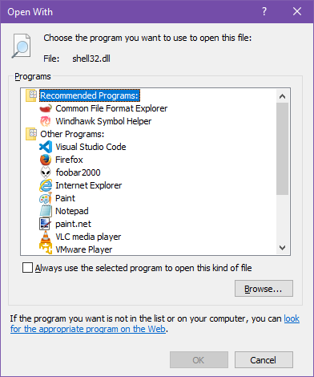
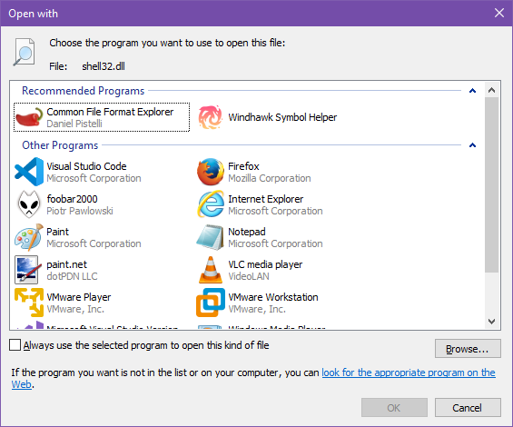

# OpenWithEx
This application is a replacement for OpenWith.exe meant to replicate the Open With dialog from Windows XP,
Vista and 7.

**Windows XP design**:

**Windows Vista/7 design**:

## Installation
**NOTE: This software is in early development and you should not use it on a daily basis over the regular
open with dialog. This is for testing only.**

1. Make sure you have already built OpenWithEx.
2. Open the Registry Editor.
3. Navigate to `HKEY_CLASSES_ROOT\CLSID\{e44e9428-bdbc-4987-a099-40dc8fd255e7}\LocalServer32`.
4. Right click it, and click "Permissions".
5. Click "Advanced".
6. Click "Change" next to the current owner.
7. Type your username, and click OK until you're back to the main Permissions dialog.
8. Click "Add...".
9. Type your username, and click OK.
10. Check the "Full Control" permission, and click OK.
11. Change the (Default) value (which should be `%SystemRoot%\System32\OpenWith.exe`) to the path of OpenWithEx's executable.

## Compilation

Simply open `OpenWithEx.sln` in Visual Studio 2022 and compile the whole solution. If you want the Windows XP design, uncomment
the line in `OpenWithEx/openwithex.h` that says `#define XP` and rebuild the whole solution.